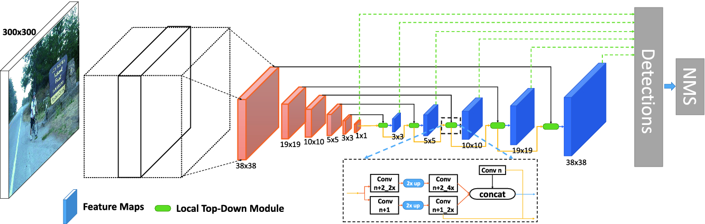
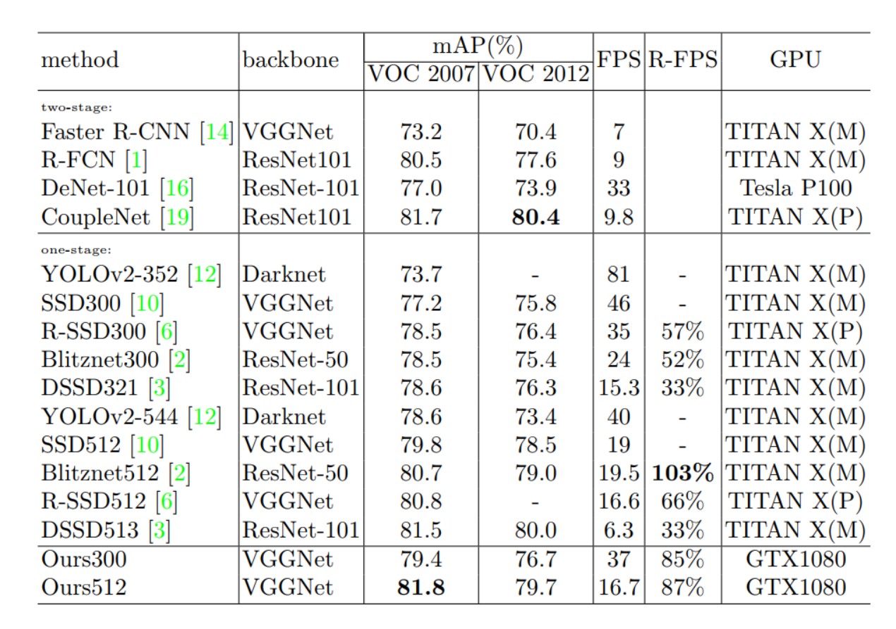
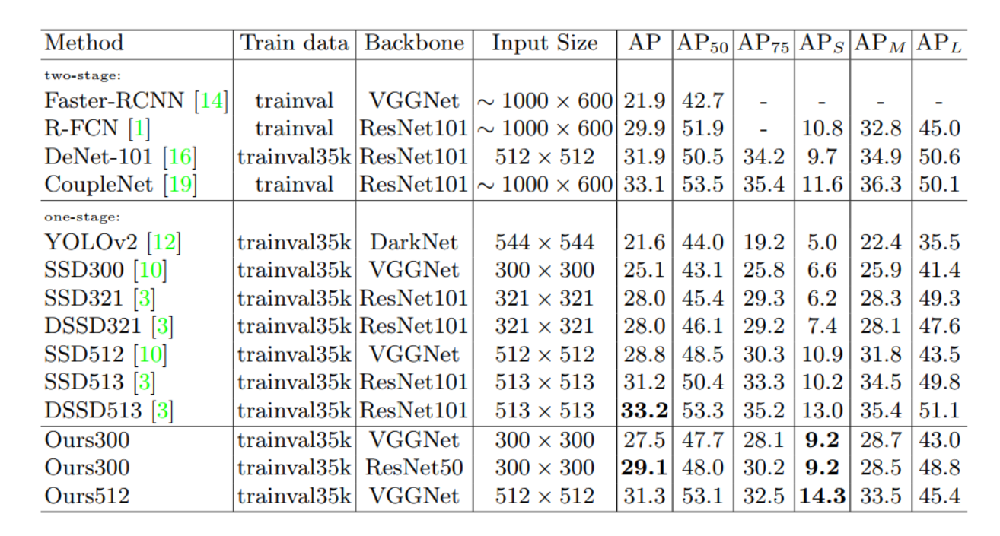
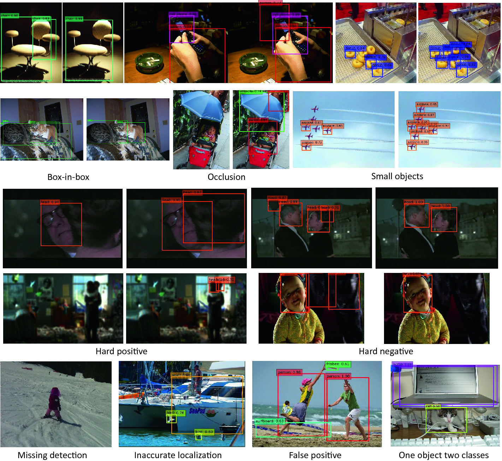

# Local-Top-Down-Detection-Network
This is the offical realization of "[A Local Top-Down Module for Object Detection with Multi-Scale Features][1]".

## network
Our model architecture is defined as depicted bellow, please refer to the paper for more details:

## results
### Comparisions with SOTAs on PASCAL VOC

### Comparisions with SOTAs on MS COCO

### Visual results between SSD300 and Ours300.

## Install 
Please follow the [instructions][2] to install the SSD correctly, replace with our *.prototxt in ./models will work and reproduce our results publish in the paper.

[1]: https://www.researchgate.net/publication/328683725_A_Local_Top-Down_Module_for_Object_Detection_with_Multi-scale_Features_First_Chinese_Conference_PRCV_2018_Guangzhou_China_November_23-26_2018_Proceedings_Part_IV
[2]: https://github.com/weiliu89/caffe/tree/ssd

## Ack
Thanks Wei Liu for the SSD work. 
